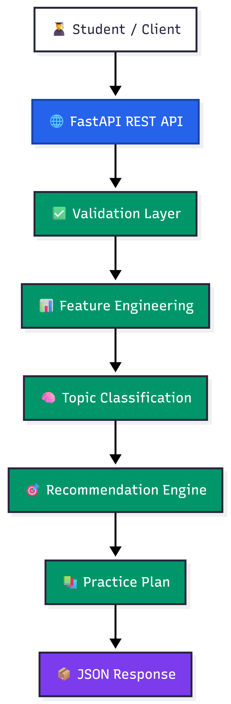
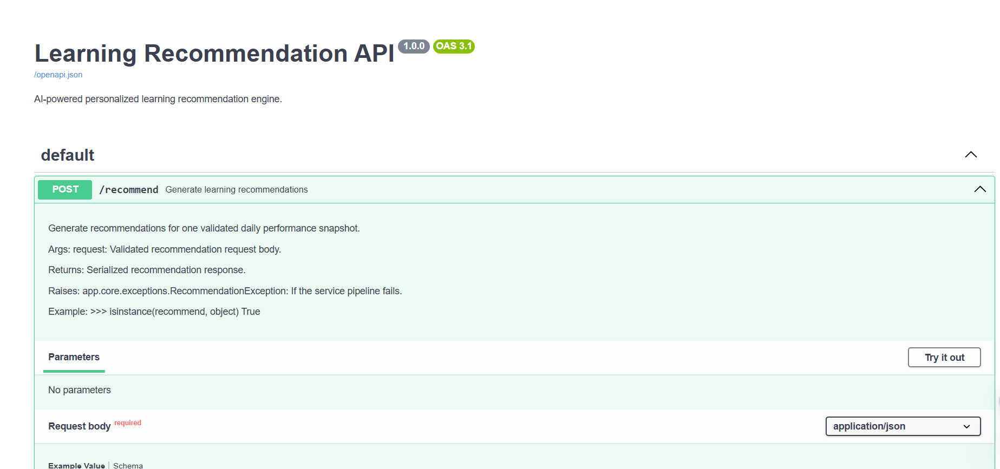
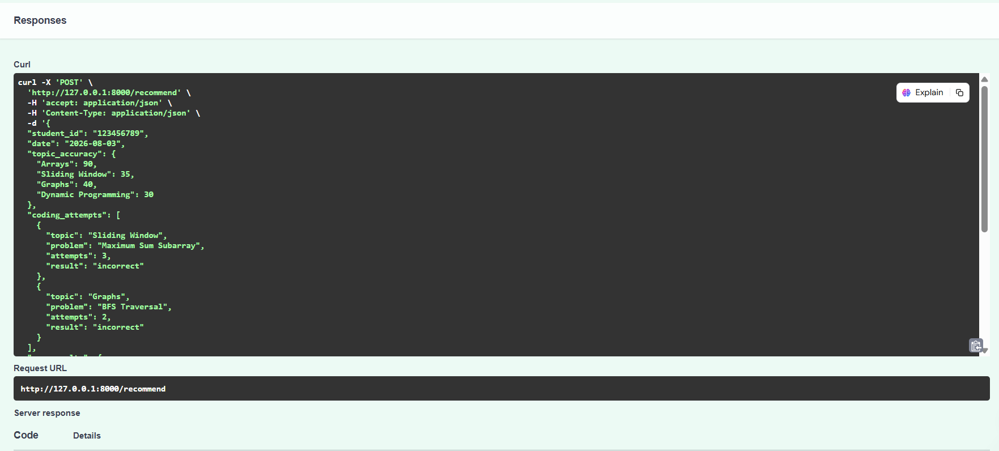
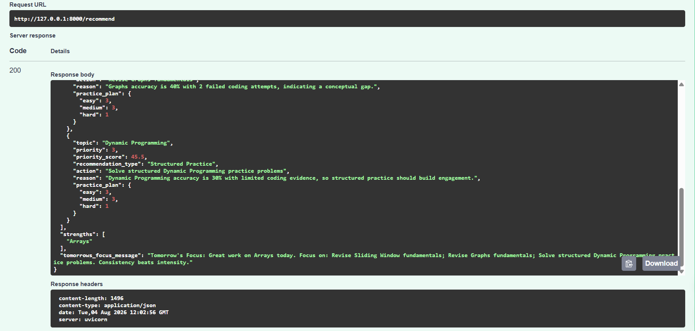

<div align="center">

# 🎯Learning Recommendation Engine
 
**An explainable, rule-driven FastAPI service that turns raw student practice data into personalized, prioritized study plans.**
 
[](https://www.python.org/)
[](https://fastapi.tiangolo.com/)
[](https://docs.pydantic.dev/)
[](https://docs.pytest.org/)
[](https://www.docker.com/)
[](https://docs.astral.sh/ruff/)
[](https://black.readthedocs.io/)
[](LICENSE)
 

 
</div>

---
 
## 📖 Overview
 
**LearnPath AI** analyzes a student's daily practice signals — topic-wise accuracy, failed coding attempts, MCQ performance, and solving speed — and turns them into a transparent, rule-based diagnosis of *where the student stands* and *what they should do next*.
 
Every topic is classified into a mastery tier, every recommendation carries a human-readable reason, and every response ships with a ready-to-use daily practice plan. No black-box scoring — every number the API returns can be traced back to a documented rule.
 
**Why it's useful:**
 
- 🧠 **Explainable, not a black box** — every recommendation states *why* (e.g. *"Sliding Window accuracy is 35% with 3 failed attempts, indicating a conceptual gap"*).
- 🎯 **Prioritized, not just listed** — weak topics are ranked by a weighted priority score, so students know what to fix first.
- 🧩 **Deterministic & stateless** — same input always produces the same output; no hidden session state between requests.
- 🛡️ **Strictly validated** — every payload is checked by Pydantic before it ever touches business logic.
---
 
## ⚡ Key Features
 
| Category | Feature |
| :--- | :--- |
| **Core Engine** | 8-stage analysis pipeline: validate → normalize → feature engineering → classify → score → recommend → plan → respond |
| **Classification** | 5-tier topic mastery model — `Mastered` · `Strong` · `Moderate` · `Weak` · `Critical` |
| **Scoring** | Weighted priority score from accuracy, failed attempts, solving speed, and consistency |
| **Recommendations** | Topic-specific actions, plain-language reasons, and tiered practice plans (easy / medium / hard) |
| **API** | Single, well-documented `POST /recommend` contract with strict status-code semantics |
| **Validation** | Pydantic v2 models enforce ID formats, 0–100 accuracy ranges, and payload size limits |
| **Quality** | Pytest suite, `ruff` linting, `black` formatting, `isort` import ordering |
| **Ops** | Dockerized for one-command local runs and deployment |
| **Docs** | Auto-generated Swagger UI & ReDoc, plus hand-written architecture references in `Docs/` |
 
---

<<<<<<< HEAD
 
## 🚀 Quick Start
 
### Prerequisites
 
- Python **3.11+**
- Git
- pip
### Setup
 
```bash
# 1. Clone the repository
git clone https://github.com/kushjainv1903/Learning-Recommendation-Engine.git
cd Learning-Recommendation-Engine
 
# 2. Create and activate a virtual environment
python -m venv .venv
source .venv/bin/activate        # Windows: .venv\Scripts\Activate.ps1
 
# 3. Install dependencies
pip install -r requirements.txt
 
# 4. Run the server
uvicorn app.main:app --reload
```
 
The API is now live at `http://127.0.0.1:8000`, with interactive docs at `/docs` (Swagger UI).
 
 
📘 Full setup, troubleshooting, and platform-specific notes live in **[Docs/Installation.md](Docs/Installation.md)**.
 
---
=======
>>>>>>> f62f755 (Readme)
 
## 🧠 How It Works
 
Every request flows through an 8-stage pipeline before a response is returned:
 
<div align="center">
<<<<<<< HEAD

=======

>>>>>>> f62f755 (Readme)
</div>

#### 🔄 Recommendation Pipeline Workflow


The engine executes every incoming request through an 8-stage automated analytical pipeline:

| Stage | Name | Key Responsibility |
| :---: | :--- | :--- |
| **01** | **Validate** | Rejects malformed JSON, invalid data types, or out-of-range payloads before processing. |
| **02** | **Normalize** | Standardizes raw input structure into a unified, consistent internal data model. |
| **03** | **Feature Engineering** | Derives aggregated per-topic accuracy, total failure counts, and solving speed signals. |
| **04** | **Topic Classifier** | Categorizes each topic into a performance mastery tier based on defined threshold rules. |
| **05** | **Priority Scoring** | Computes a weighted urgency score for identified weak and critical topics. |
| **06** | **Action Items** | Formulates specific action recommendations and human-readable reasoning per topic. |
| **07** | **Practice Plan** | Builds a structured `Easy` / `Medium` / `Hard` problem-count breakdown for each target area. |
| **08** | **Output Assembly** | Constructs and validates the final contract-compliant JSON response payload. |

---

> ℹ️ **Note:** If validation fails at **Stage 01**, the pipeline halts immediately and returns a structured `422 Unprocessable Entity` response without executing subsequent stages.
 ---
### Topic classification tiers
 
| Tier | Meaning |
| :--- | :--- |
| 🟢 **Mastered** | Consistently high accuracy — no intervention needed |
| 🔵 **Strong** | Solid grasp with minor room to sharpen |
| 🟡 **Moderate** | Inconsistent performance — light reinforcement recommended |
| 🟠 **Weak** | Clear conceptual gaps — targeted practice required |
| 🔴 **Critical** | Low accuracy combined with repeated failed attempts — top priority |
 
### Priority score weighting
 
The priority score behind each recommendation blends four signals:
 
| Signal | Weight |
| :--- | :---: |
| Topic accuracy | 45% |
| Failed coding attempts | 25% |
| Average solving time | 20% |
| Practice consistency | 10% |
 
---
 
## 🏛️ Architecture
 
The service follows a strictly layered architecture — each layer has one job, and no layer reaches past its boundary.
 
<div align="center">

</div>

### 🏗️ Architecture & Codebase Structure

The application follows a modular, layer-separated architecture to maintain a clear separation of concerns across the recommendation pipeline:

| Layer | Module / Location | Core Responsibility |
| :--- | :--- | :--- |
| 🌐 **API Layer** | [`app/api/routes.py`](app/api/routes.py) | Ingests incoming HTTP requests, handles routing, and serializes responses. |
| 🛡️ **Validation Layer** | [`app/models/`](app/models/) | Defines Pydantic schemas, enforces type safety, and handles early rejection. |
| ⚙️ **Feature Engineering** | [`app/services/feature_extractor.py`](app/services/feature_extractor.py) | Aggregates accuracy metrics, attempt counts, and speed indicators. |
| 🏷️ **Classification** | [`app/services/classifier.py`](app/services/classifier.py) | Maps performance metrics into topic mastery tiers (`Mastered`, `Strong`, `Weak`, `Critical`). |
| 📊 **Scoring** | [`app/services/scorer.py`](app/services/scorer.py) | Calculates weighted recommendation urgency and priority scores. |
| 🧠 **Recommendation Engine** | [`app/services/recommendation_engine.py`](app/services/recommendation_engine.py) | Orchestrates the end-to-end analytical pipeline. |
| 💬 **Explanation & Messaging** | [`app/services/explanation_generator.py`](app/services/explanation_generator.py)<br>[`app/services/message_generator.py`](app/services/message_generator.py) | Formulates human-readable action rationale and builds the "Tomorrow's Focus" daily message. |
| 📦 **Response Layer** | [`app/models/response_models.py`](app/models/response_models.py) | Enforces final response data structure against the API contract. |

---

> 💡 **Design Pattern:** Services in `app/services/` remain decoupled from API routing logic, making them easily testable and reusable across background workers or alternate interface layers.
 
<details>
<summary><strong>More diagrams</strong> — recommendation pipeline & request lifecycle</summary>
<br>

<div align="center">
<br><br>

</div>
</details>
📘 Full architectural breakdown: **[Docs/Architecture.md](Docs/Architecture.md)**
 
---
 
## 🧪 Testing
 
The project is backed by a comprehensive Pytest suite covering unit, integration, edge-case, and API-contract testing.
 
```bash
# Run the full suite
pytest
 
# With coverage
pytest --cov=app
 
# Lint & format check
ruff check .
black --check .
isort --check .
```
 
---
 
## 🖼️ Gallery
 
<div align="center">

<br><br>


</div>

---

# 🛠️ Installation & Setup

## Prerequisites

* Python 3.10 or higher
* pip (Python package manager)
* Git

---

### Step 1: Clone the Repository

```bash
git clone [https://github.com/your-username/Learning-Recommendation-Engine.git](https://github.com/your-username/Learning-Recommendation-Engine.git)
cd Learning-Recommendation-Engine
```

### Step 2: Create Virtual Environment
```Bash
python -m .venv venv
source venv/bin/activate  # On Windows: .\.venv\Scripts\activate
```

### Step 3: Install Dependencies
```Bash
pip install -r requirements.txt #These are not yet added
```


### Step 4: Run the Application
```Bash
uvicorn app.main:app --reload
```
The application will be available at http://127.0.0.1:8000/docs

📘 Full setup, troubleshooting, and platform-specific notes live in **[Docs/Installation.md](Docs/Installation.md)**.
 
---
 
## 📚 Documentation
 
| Doc | Description |
| :--- | :--- |
| [Docs/Installation.md](Docs/Installation.md) | Full setup, environment, and troubleshooting guide |
| [Docs/API.md](Docs/API.md) | Complete request/response schema and error reference |
| [Docs/Architecture.md](Docs/Architecture.md) | Layer-by-layer architectural breakdown |
 
---
 
## 🤝 Contributing
 
Contributions, issues, and feature requests are welcome.
 
1. Fork the repository
2. Create a feature branch (`git checkout -b feature/your-feature`)
3. Run `black .`, `isort .`, and `ruff check .` before committing
4. Make sure `pytest` passes locally
5. Open a pull request with a clear description of the change
---
 
<<<<<<< HEAD
## 📄 License
 
Distributed under the **MIT License**. See [LICENSE](LICENSE) for details.
 

 
</div>
 
=======
</div>
 
>>>>>>> f62f755 (Readme)
